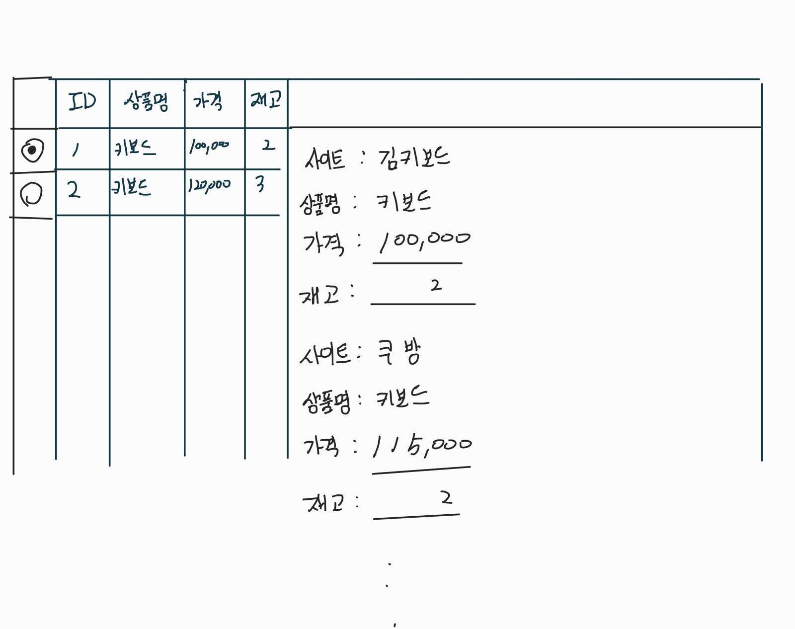

# 프론트 엔드 코딩테스트 과제

커스텀 키보드를 판매하는 쇼핑몰을 운영하는 **김키보드**사는 키보드를 회사내부에서 운영하는 EC사이트와 별도의 판매 사이트로 쿠방, 10번가, Z마켓에 상품을 등록학고 있습니다.
커스텀 키보드는 공장에서 제작하는 것이 아니라 직접 수작업으로 제작하기때문에 재고 관리가 어렵습니다. 서버에서는 재고를 관리하기 위해 상품을 등록할때 각각의 사이트의 API를 이용해서 상품의 재고를 조절합니다.
하지만 사이트마다 판매 수수료와 배송 수수료가 다르기때문에 상품을 등록하는 과정에서 수수료를 계산해야합니다. 또한 배송비가 포함되는 사이트와 배송비를 별도로 지불해야하는 사이트가 있기 때문에 배송비 계산도 필요합니다.
커스텀 키보드는 공방에서 제작하여 재고를 시스템에 등록합니다. 김키보드 판매관리부서에서는 시스템에 등록된 재고를 각각의 판매 사이트에 등록해야합니다.
김키보드 판매관리부서에서는 재고를 등록하고 판매 사이트에 등록하는 과정을 자동화하기 위해 개발자를 고용하였습니다. 개발자는 재고를 등록하고 판매 사이트에 등록하는 과정을 자동화하기 위해 아래와 같은 요구사항을 제시하였습니다.


## 요구사항

 판매관리 부서에서는 상품을 등록할때 수수료와 배송비를 계산해서 한번에 보고싶어 합니다.
상품 데이터를 조회하여 한번에 계산하고 상품 가격을 조정한 뒤 각각의 사이트에 상품을 등록합니다.
다행스럽게도 등록하는 사이트는 백엔드에서 제공하는 API를 이용해서 상품을 등록할 수 있습니다.
판매관리 부서에 고용된 당신은 다음과 같은 요구조건에 해당하는 화면을 만들어야 합니다.

1. 상품 데이터를 조회할 수 있어야 합니다.
2. 각각의 판매 사이트의 수수료와 배송비 정책에 맞게 상품의 수수료와 배송비를 계산해야합니다.
3. 계산된 수수료와 배송비를 별도로 표시해야합니다.
4. 최종적으로 등록되는 가격과 수량을 화면에 표시해야합니다.
5. 화면에 표시된 상품의 가격과 수량을 수정할 수 있어야합니다.
6. 상품의 가격과 수량을 수정하면 각각의 판매 사이트에 등록되는 가격과 수량이 자동으로 변경되어야합니다.
7. 상품 등록 API를 이용해서 상품을 등록해야 합니다.

판매관리부서의 부장이 다행(?)스럽게도 다음과 같은 화면이라고 제시 합니다.



### 각 사이트의 판매 수수료와 배송비는 다음과 같습니다.

| 사이트  | 판매 수수료 | 배송비  | 배송비 포함여부 |     Site     |
|:----:|:------:|:----:|:--------:|:------------:|
| 김키보드 |   0%   | 2500 |    별도    | KIM_KEYBOARD |
|  쿠방  |  15%   | 2000 |    별도    |    CUBANG    |
| 10번가 |  20%   | 3000 |    포함    |  TEN_STREET  |
| Z마켓  |  25%   |  0   |    포함    |   Z_MARKET   |


상품 데이터는 다음과 같이 주어집니다.
HOST: https://fhqbyy4mm6.execute-api.ap-northeast-2.amazonaws.com/dev
```shell
GET {{HOST}}/products
Content-Type: application/json
```
```json
[
  {
    "id": "1",
    "name": "Z 키보드",
    "price": "10000",
    "stock": "2"
  }
]
```

상품 등록 API는 다음과 같이 주어집니다.
HOST: https://fhqbyy4mm6.execute-api.ap-northeast-2.amazonaws.com/dev
### 등록 API
```shell
POST {{HOST}}/products
Content-Type: application/json
```
### Request Body 예문
```json
{
  "product": {
    "id": "1",
    "name": "Z 키보드",
    "price": "10000",
    "stock": "2"
  },
  "siteProducts":[
    {
      "site": "KIM_KEYBOARD",
      "name": "Z 키보드",
      "price": "10000",
      "stock": "2"
    },
    {
      "site": "CUBANG",
      "name": "Z 키보드",
      "price": "10000",
      "stock": "2"
    }
  ]
}
```
